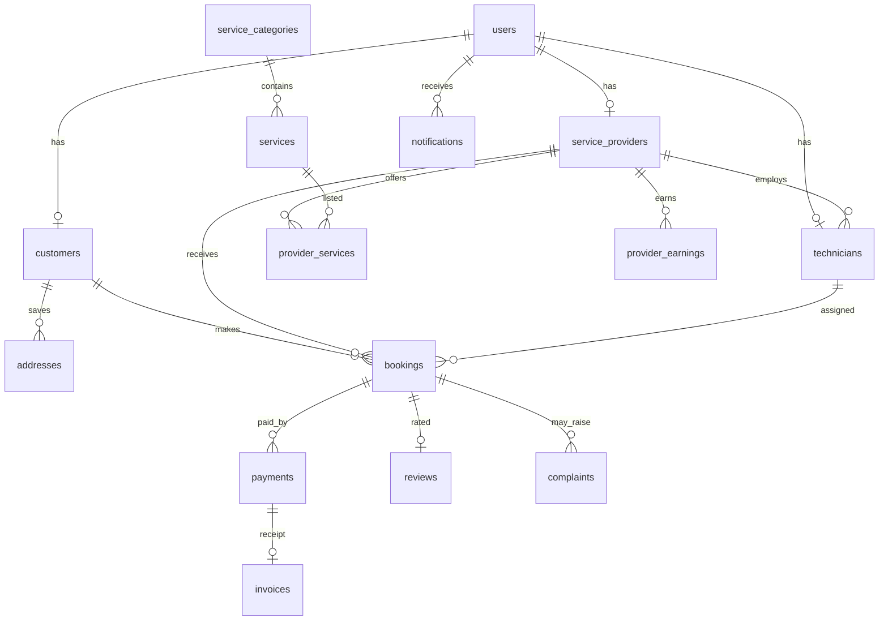

# Database

Live API: Render Postgres, free plan, linked by `DATABASE_URL`.  
Written MySQL script: `docs/schema.sql`. SQLAlchemy talks to both.

```mermaid
erDiagram
  users ||--o| customers : has
  users ||--o| service_providers : has
  users ||--o| technicians : has
  service_providers ||--o{ technicians : employs
  service_providers ||--o{ provider_services : offers
  service_categories ||--o{ services : contains
  services ||--o{ provider_services : listed
  customers ||--o{ addresses : saves
  customers ||--o{ bookings : makes
  service_providers ||--o{ bookings : receives
  technicians ||--o{ bookings : assigned
  bookings ||--o{ payments : paid_by
  payments ||--o| invoices : receipt
  bookings ||--o| reviews : rated
  bookings ||--o{ complaints : may_raise
  users ||--o{ notifications : receives
  service_providers ||--o{ provider_earnings : earns
```
